中文 | [English](./ARCHITECTURE-en.md)

# 架构设计

本文档详细介绍 DataAgent 的系统架构、核心能力和技术实现。

## 📐 总体架构图

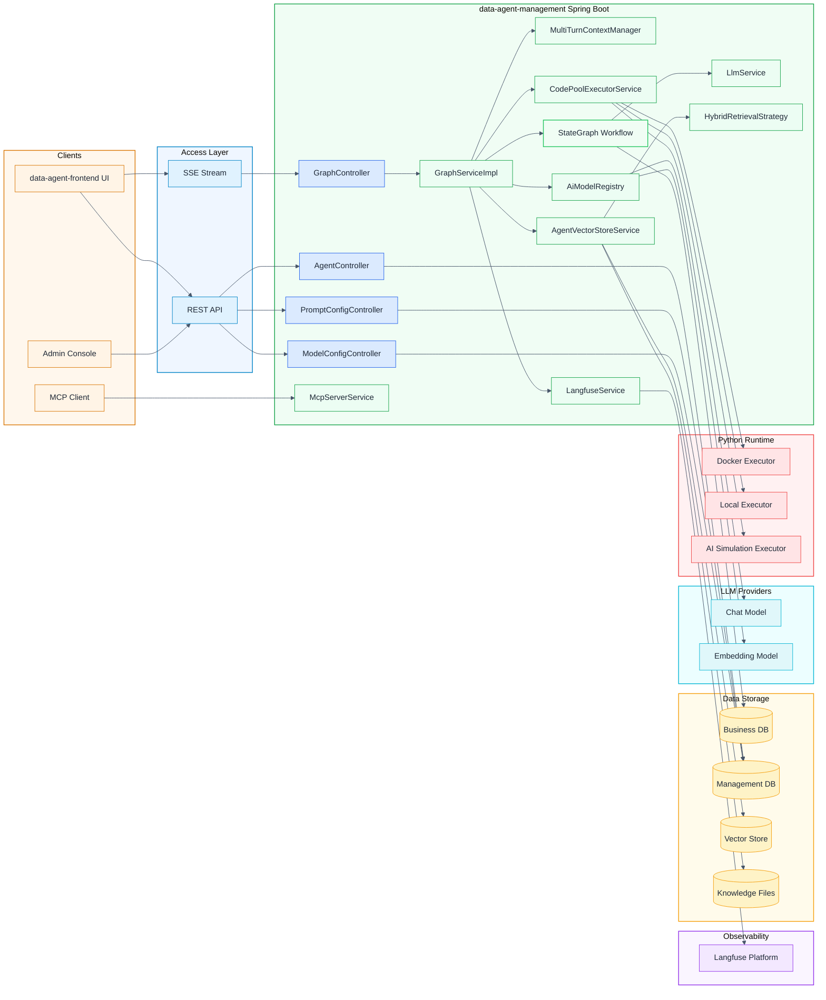

## 🔄 运行时主流程

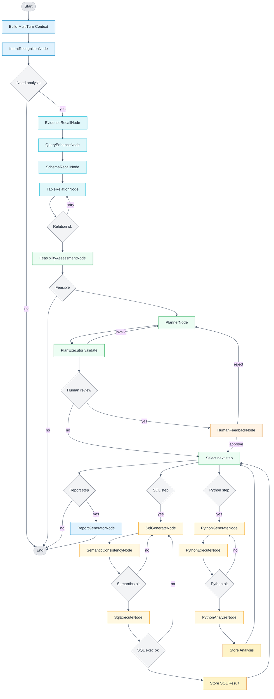

## 🎯 关键能力说明

### 1. 人类反馈机制

#### 说明要点

- **入口**: 运行时请求参数 `humanFeedback=true`（`GraphController` → `GraphServiceImpl`）
- **数据字段**: `human_review_enabled`以运行时请求参数为准
- **图编排**: `PlanExecutorNode` 检测 `HUMAN_REVIEW_ENABLED`，转入 `HumanFeedbackNode`
- **暂停与恢复**: `CompiledGraph` 使用 `interruptBefore(HUMAN_FEEDBACK_NODE)`，无反馈时进入"等待"，反馈到达后通过 `threadId` 继续执行
- **反馈结果**: 同意继续执行；拒绝则回到 `PlannerNode` 并触发重新规划

#### 架构图

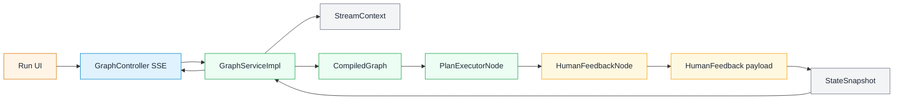

#### 流程图

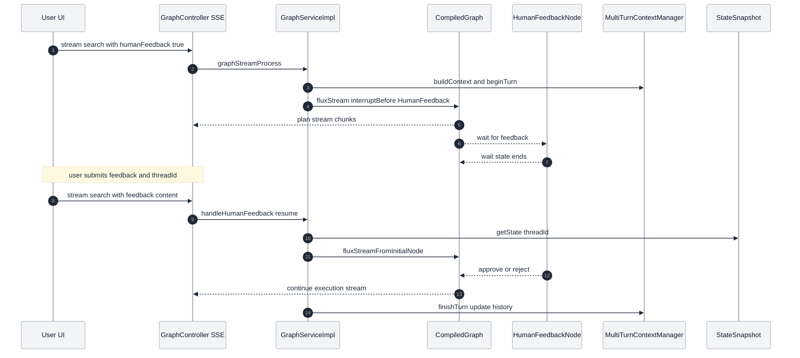

### 2. Prompt 配置与自动优化

#### 说明要点

- **配置入口**: `/api/prompt-config/*`，数据表 `user_prompt_config`
- **作用范围**: 支持按 `agentId` 绑定或全局配置（`agentId` 为空）
- **Prompt 类型**: `report-generator`、`planner`、`sql-generator`、`python-generator`、`rewrite`
- **自动优化方式**: `ReportGeneratorNode` 拉取启用配置（按 `priority` 与 `display_order` 排序），通过 `PromptHelper.buildReportGeneratorPromptWithOptimization` 拼接"优化要求"
- **当前实现重点**: 报告生成节点已落地优化；其他类型为预留能力

#### 架构图

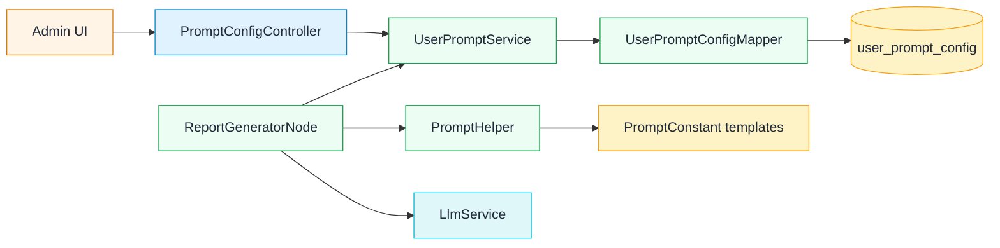

#### 流程图

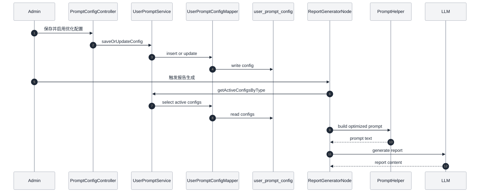

### 3. RAG 检索增强

#### 说明要点

- **查询重写**: `EvidenceRecallNode` 调用 LLM 生成独立检索问题
- **召回通道**: `AgentVectorStoreService` 执行向量检索；可选混合检索（向量+关键词，`AbstractHybridRetrievalStrategy`）
- **文档类型**: 业务知识 + 智能体知识，按元数据过滤并合并为 evidence 注入后续 prompt
- **关键配置**: `spring.ai.alibaba.data-agent.vector-store.enable-hybrid-search` 及相似度/TopK 等参数

#### 架构图

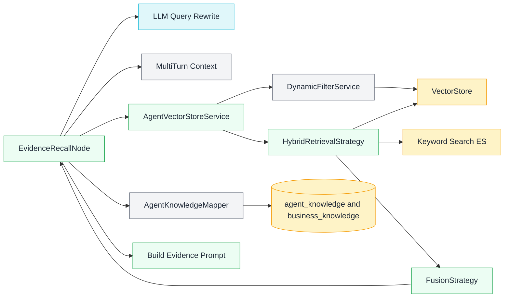

#### 流程图

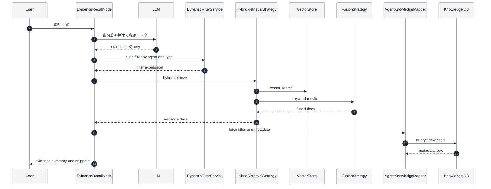

### 4. 报告生成与摘要生成

#### 说明要点

- **报告节点**: `ReportGeneratorNode` 读取计划、SQL/Python 结果与摘要建议（`summary_and_recommendations`）
- **优化提示词**: 自动拼接优化配置后生成报告

#### 架构图

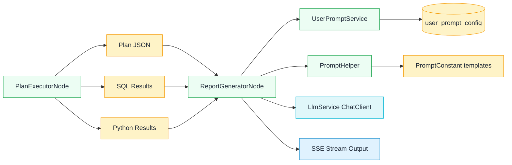

#### 流程图

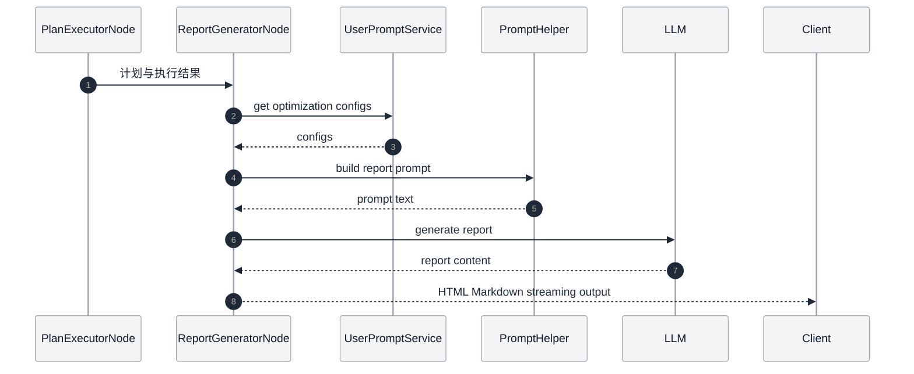

### 5. 流式输出与多轮对话

#### 说明要点

- **流式输出**: `GraphController` SSE + `GraphServiceImpl` 流式处理
- **文本标记**: `TextType` 在流中标记 SQL/JSON/HTML/Markdown，前端据此渲染
- **多轮对话**: `MultiTurnContextManager` 记录"用户问题+规划结果"，注入到后续请求
- **模式切换**: `spring.ai.alibaba.data-agent.llm-service-type` 支持 `STREAM/BLOCK`

#### 架构图

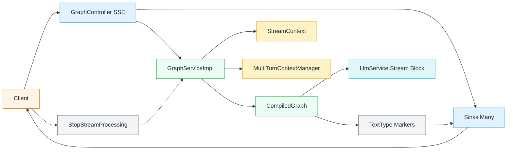

#### 流程图

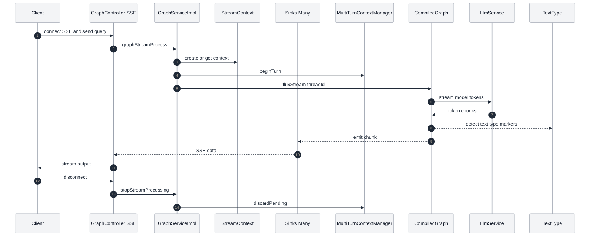

### 6. MCP 与多模型调度

#### 说明要点

- **MCP**: `McpServerService` 提供 NL2SQL 与 Agent 列表工具，使用 Mcp Server Boot Starter
- **多模型调度**: `ModelConfig*` 配置模型，`AiModelRegistry` 缓存当前 Chat/Embedding 模型并支持热切换（同一时间每类仅一个激活模型）
- **已内置工具**: `nl2SqlToolCallback`、`listAgentsToolCallback`

#### 架构图

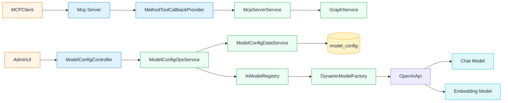

#### 流程图

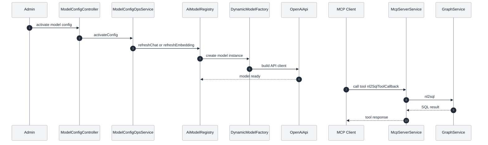

### 7. API Key 与权限管理

#### 说明要点

- **管理端**: `AgentController` 支持生成、重置、删除与启用/禁用 API Key
- **数据字段**: `agent.api_key` 与 `agent.api_key_enabled`
- **调用方式**: 请求头 `X-API-Key`（需自行实现后端校验逻辑）
- **注意**: 默认后端未对 `X-API-Key` 做鉴权拦截，生产需自行补充

#### 架构图

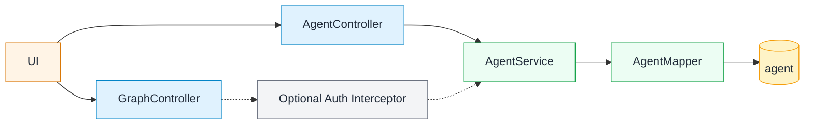

#### 流程图

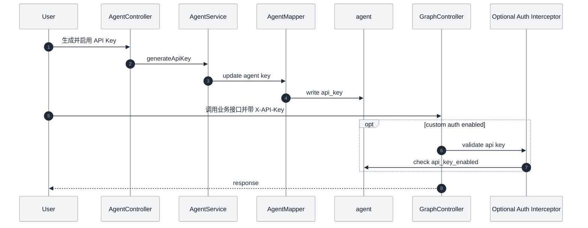

### 8. Python 执行与结果回传

#### 说明要点

- **代码生成**: `PythonGenerateNode` 根据计划与 SQL 结果生成 Python
- **代码执行**: `PythonExecuteNode` 使用 `CodePoolExecutorService`（Docker/Local/AI 模拟）
- **执行配置**: `spring.ai.alibaba.data-agent.code-executor.*`（默认 Docker 镜像 `continuumio/anaconda3:latest`）
- **结果回传**: 执行结果写回 `PYTHON_EXECUTE_NODE_OUTPUT`，`PythonAnalyzeNode` 汇总后写入 `SQL_EXECUTE_NODE_OUTPUT`，用于最终报告

#### 架构图

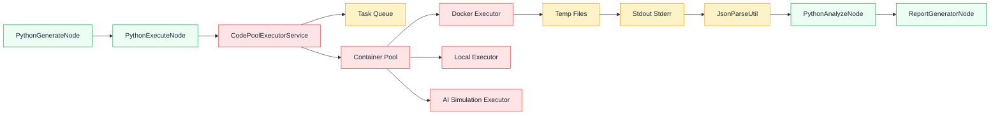

#### 流程图

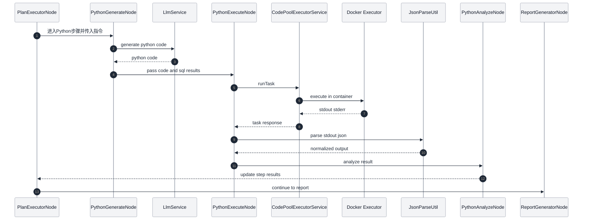

## 🔗 相关文档

- [快速开始](QUICK_START.md) - 安装配置指南
- [高级功能](ADVANCED_FEATURES.md) - API调用和MCP服务器
- [开发者文档](DEVELOPER_GUIDE.md) - 贡献指南
